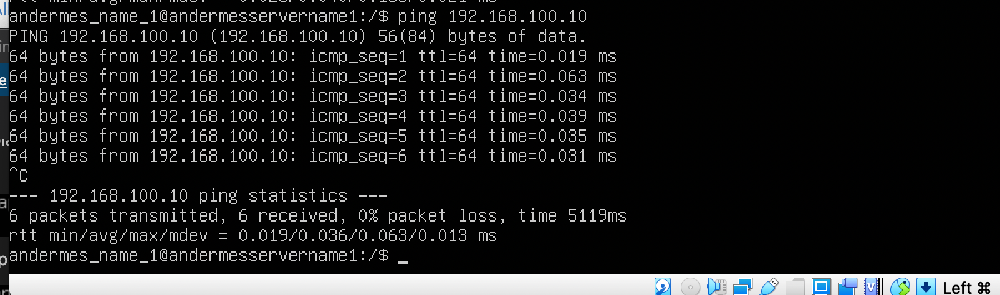

## Part 1. Инструмент **ipcalc**

**==1.1 Сети и маски==**

Поднимаем виртуальную машину с помощью Virtual box. Берем за основу серверный диструбутив Ubuntu 20.04.6 LTS
Определяем с помощью команды ipcalc 192.167.38.54/13, устанавливая перед этим при необходимости сам ipcalc (sudo apt install ipcalc), следующую информацию
1.1.1) адрес сети 192.167.38.54/13
1.1.2) перевод маски 255.255.255.0 в префиксную и двоичную запись, /15 в обычную и двоичную, 11111111.11111111.11111111.11110000 в обычную и префиксную
1.1.3) минимальный и максимальный хост в сети 12.167.38.4 при масках: /8, 11111111.11111111.00000000.00000000, 255.255.254.0 и /4

1.1.1) Определил адрес сети 192.167.38.54/13

1.1.2.а) Перевел маску 255.255.255.0 в префиксную и двоичную запись

1.1.2.б) Перевел маску /15 в обычную и двоичную

1.1.2.в) Перевел маску 11111111.11111111.11111111.11110000 в обычную и префиксную

1.1.3.a) Минимальный и максимальный хост в сети 12.167.38.4 при масках: /8 

1.1.3.б) Минимальный и максимальный хост в сети 12.167.38.4 при масках: 11111111.11111111.00000000.00000000

1.1.3.в) Минимальный и максимальный хост в сети 12.167.38.4 при масках: 255.255.254.0

1.1.4.г) Минимальный и максимальный хост в сети 12.167.38.4 при масках: /4

**==1.2. localhost==**

1.2. Из перечисленных IP к хосту можно обратиться со следующими IP: 127.0.0.2, 127.1.0.1

**==1.3. Диапазоны и сегменты сетей==**

1.3.1)Частные IP находяться в диапазонах: 10.0.0.0 - 10.255.255.255,  172.16.0.0 - 172.31.255.255,  192.168.0.0 - 192.168.255.255

Таким образом частные IP адреса: 10.0.0.45, 192.168.4.2, 172.20.250.4, 172.16.255.255, 10.10.10.10

Таким образом публичные IP адреса: 134.43.0.2, 172.0.2.1, 192.172.0.1, 172.68.0.2, 192.169.168.1

1.3.2)Из перечисленных IP адресов шлюза возможны у сети 10.10.0.0/18: 10.10.0.2, 10.10.10.10,10.10.1.255

## Part 2. Статическая маршрутизация между двумя машинами

2.0)Вывод команды ip a на двух машинах

Содержание изменённого файла etc/netplan/00-installer-config.yaml на первой машине
И Выполнение команды netplan apply

Содержание изменённого файла etc/netplan/00-installer-config.yaml на второй машине
И Выполнение команды netplan apply

**==2.1 Добавление статического маршрута вручную==**

Ввод команды sudo ip r add 172.24.116.8 dev enp0s3 на первой машине

Ввод команды sudo ip r add 192.168.100.10 dev enp0s3на второй машине

Пропинговал соединение на первой машине

Пропинговал соединение на второй машине

Содержание изменённого файла etc/netplan/00-installer-config.yaml на первой машине

Содержание изменённого файла etc/netplan/00-installer-config.yaml на второй машине

Пропинговал соединение на обоих машинах

## Part 3. Утилита iperf3

**==3.1 Скорость соединения==**

8 Mbps -> 1 MB/s 100 MB/s -> 800000 kbps 1 Gbps -> 1000 Mbps

**==3.2 Утилита iperf3==**

Измеряем скорость 

## Part 4. Сетевой экран

**==4.1 Утилита iptables==**

Cодержанием файлов /etc/firewall.sh для обоих машин

Запуск файлов на обеих машинах командами chmod +x /etc/firewall.sh и /etc/firewall.sh

Пропинговал соединение на машинах

**==4.2. Утилита nmap==**

Командой ping нашел машину, которая не "пингуется"

## Part 5. Статическая маршрутизация сети

**==5.1. Настройка адресов машин==**

Настроиваем конфигурации машин в etc/netplan/00-installer-config.yaml согласно сети на рисунке.

На всех машинах

Отчёт скринов с вызовом и выводом использованных команд.

Пинг машин. На левом ping ws22 с ws21, На правом ping r1 с ws11:

**==5.2 Включение переадресации IP-адресов.==**

Включение переадресации IP, выполняем команду на роутерах:

sysctl -w net.ipv4.ip_forward=1

Включаем постоянную переодресацию на них же

**==5.3. Установка маршрута по-умолчанию ==**

Cкрины с содержанием файла etc/netplan/00-installer-config.yaml во машинах ws11 ws22 ws21

Скрины запуска команды ip r на всех машинах

Пингуем c ws11 r2 

**==5.4. Добавление статических маршрутов ==**

Добавляем в роутеры r1 и r2 статические маршруты в файле конфигураций. 

Вызвать ip r на двух машинах

Запускаем команды на ws11:
ip r list 10.10.0.0/[маска сети] и ip r list 0.0.0.0/0

**==5.5. Построение списка маршрутизаторов==**

Запустить на r1 команду дампа:
tcpdump -tnv -i enp0s8

**==5.6. Использование протокола ICMP при маршрутизации==**

Запускаем на r1 перехват сетевого трафика, проходящего через eth0 с помощью команды:
tcpdump -n -i eth0 icmp

Пропинговать с ws11 несуществующий IP (например, 10.30.0.111) с помощью команды:

## Part 6. Динамическая настройка IP с помощью DHCP

Настроим d r2 в файле /etc/dhcp/dhcpd.conf конфигурацию службы DHCP:

в файле resolv.conf прописываем nameserver 8.8.8.8.

Перезагрузить службу DHCP командой systemctl restart isc-dhcp-server. Машину ws21 перезагрузить при помощи reboot и через ip a показать, что она получила адрес. Также пропинговать ws22 с ws21.

Указать MAC адрес у ws11, для этого в etc/netplan/00-installer-config.yaml надо добавить строки: macaddress: 10:10:10:10:10:BA, dhcp4: true

Для r1 настроить аналогично r2, но сделать выдачу адресов с жесткой привязкой к MAC-адресу (ws11). Провести аналогичные тесты

Запросить с ws21 обновление ip адреса

## Part 7. NAT

В файле /etc/apache2/ports.conf на ws22 и r1 изменить строку Listen 80 на Listen 0.0.0.0:80, то есть сделать сервер Apache2 общедоступным

Запустить веб-сервер Apache командой service apache2 start на ws22 и r1

Добавить в фаервол, созданный по аналогии с фаерволом из Части 4, на r2 следующие правила:
1) удаление правил в таблице filter - iptables -F
2) удаление правил в таблице "NAT" - iptables -F -t nat
3) отбрасывать все маршрутизируемые пакеты - iptables --policy FORWARD DROP

Запускать файл также, как в Части 4

При запуске файла с этими правилами, ws22 не должна "пинговаться" с r1

4) разрешить маршрутизацию всех пакетов протокола ICMP

При запуске файла с этими правилами, ws22 должна "пинговаться" с r1

5) включить SNAT, а именно маскирование всех локальных ip из локальной сети, находящейся за r2 (по обозначениям из Части 5 - сеть 10.20.0.0)
Совет: стоит подумать о маршрутизации внутренних пакетов, а также внешних пакетов с установленным соединением

6) включить DNAT на 8080 порт машины r2 и добавить к веб-серверу Apache, запущенному на ws22, доступ извне сети

Проверить соединение по TCP для DNAT, для этого с r1 подключиться к серверу Apache на ws22 командой telnet (обращаться по адресу r2 и порту 8080)

## Part 7. NAT

Запустить на r2 фаервол с правилами из Части 7

Запустить веб-сервер Apache на ws22 только на localhost (то есть в файле /etc/apache2/ports.conf изменить строку Listen 80 на Listen localhost:80)

Воспользоваться Local TCP forwarding с ws21 до ws22, чтобы получить доступ к веб-серверу на ws22 с ws21

Воспользоваться Remote TCP forwarding c ws11 до ws22, чтобы получить доступ к веб-серверу на ws22 с ws11

Для проверки, сработало ли подключение в обоих предыдущих пунктах, перейдите во второй терминал (например, клавишами Alt + F2) и выполните команду:

ssh -L 8080:10.20.0.20:80 andermes@localhost - Команда открывает доступ через SSH-туннель для подключений на порт 8080 на всех интерфейсах локальной системы.

ssh -R 8080:10.20.0.10:80 andermes@localhost - Пробрасывает порт на удаленной системе в другую систему.

telnet - пользуемся им чтобы проверить сработало ли подключение в обоих предыдущих пунктах.